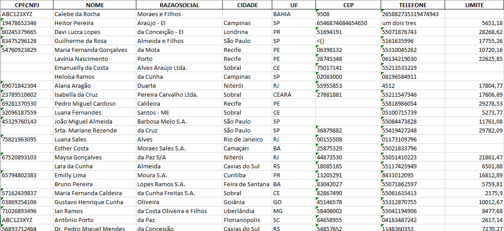
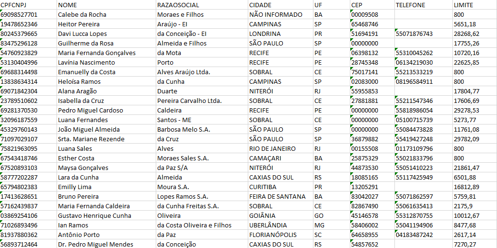
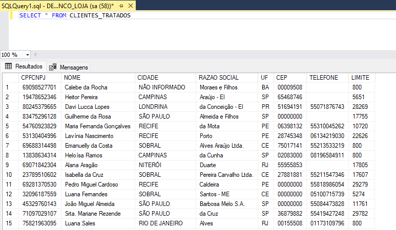
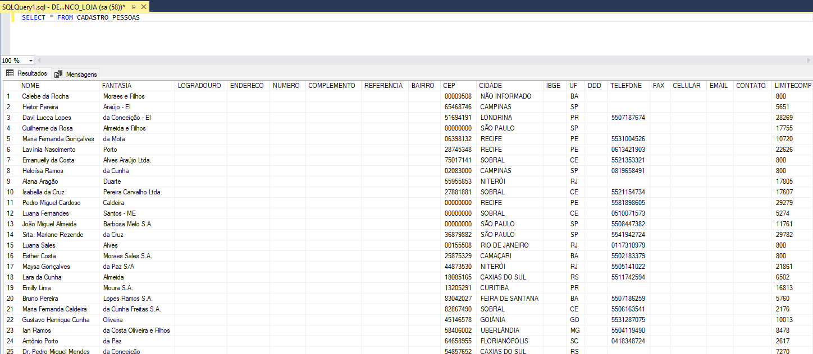

# Automação de Importação e Tratamento de Cadastro de Clientes para Implantação de ERP
---
## Sobre o Projeto 📌

Este projeto apresenta uma solução de automação para importação, tratamento e carga de cadastros de clientes durante processos de implantação de ERP no setor supermercadista. O cenário abordado foi inspirado em uma necessidade operacional recorrente observada durante a entrada de novos clientes no sistema. Normalmente, o processo de migração envolve a importação de diversas informações como:

- Produtos
- Tributação
- Clientes
- Fornecedores
- Estrutura mercadológica
- Cadastros auxiliares

Grande parte dessas atividades costuma ser realizada manualmente e exige revisão constante devido à presença de inconsistências nas bases recebidas do sistema anterior do cliente. O objetivo deste projeto foi automatizar a etapa relacionada ao cadastro de clientes utilizando Python, Pandas e SQL Server.

## Objetivo 🎯
Construir um fluxo automatizado capaz de:

✅ Importar planilhas de clientes extraídas de sistemas antigos

✅ Identificar inconsistências nos dados

✅ Aplicar regras de limpeza e padronização

✅ Gerar uma nova base tratada

✅ Criar tabela intermediária no SQL Server

✅ Inserir apenas registros inexistentes

✅ Preparar os dados para carga definitiva

## Tecnologias Utilizadas 🛠

- Python
- Pandas
- SQL Server
- Excel
- Jupyter Notebook

## Cenário de Negócio 🏪
Durante implantações de ERP em supermercados, é comum receber arquivos contendo centenas ou milhares de clientes provenientes de outros sistemas. Essas bases frequentemente apresentam problemas como:

- CPF/CNPJ inválido
- Campos vazios
- UF incorreta
- Telefones fora do padrão
- CEP incompleto
- Dados duplicados
- Falta de padronização

Sem tratamento adequado, esses problemas podem gerar falhas durante importações e inconsistências no ambiente produtivo. Este projeto propõe uma abordagem automatizada para reduzir esse trabalho operacional.

## Estrutura da Base 📄
A planilha utilizada possui 300 registros, os dados são falsos e foram gerados para esse projeto, a fim de preservar a privacidade e confidencialidade, e contém os seguintes campos:

| Campo |
|--------|
| CPFCNPJ |
| NOME |
| RAZAOSOCIAL |
| CIDADE |
| UF |
| CEP |
| TELEFONE |
| LIMITE |

Foram inseridas inconsistências propositalmente para simular situações reais encontradas em migrações de sistemas.

Exemplos:

> CPF com letras

ABC123XYZ

> UF inválida

BAHIA invés de BA

> CEP incompleto

4587

> Telefone fora do padrão

719999999999999999

> Cidade vazia



## Fluxo do Processo 🔄
O projeto foi dividido em duas etapas principais:

### Etapa 1 — Limpeza e Tratamento

Arquivo:

```text
Limpeza_Clientes.ipynb
```

Responsável por:

- Importar planilha original
- Validar campos
- Corrigir inconsistências
- Normalizar dados
- Gerar nova planilha tratada

Fluxo:

Excel → Pandas → Limpeza → Normalização → Exportação



### Etapa 2 — Importação SQL

Arquivo:

```text
Importar_Clientes_Banco.py
```

Após a geração da planilha tratada, o script realiza:

1. Leitura da base corrigida

2. Criação automática da tabela:

```sql
CLIENTES_TRATADOS
```

caso ela não exista.

3. Inserção incremental:

Somente CPFCNPJ inexistentes são adicionados.



## Carga Definitiva 🗄
Esta tabela CLIENTES_TRATADOS atua como área de validação antes da carga definitiva.

Objetivos:

- Conferência dos registros
- Validação
- Revisão operacional
- Controle de importação

Após validação, os dados podem ser enviados para:

```sql
CADASTRO_PESSOAS
```

Tabela principal do ERP.



## Principais Benefícios 🚀

### - Redução de trabalho manual

O tratamento automático elimina parte significativa da revisão manual realizada durante implantações.

### - Padronização dos cadastros

Os dados passam a seguir regras consistentes antes da importação.

### - Menor risco operacional

A utilização da tabela intermediária reduz impactos no ambiente principal.

### - Reaproveitamento do processo

O fluxo pode ser utilizado em futuras implantações com poucas adaptações.
